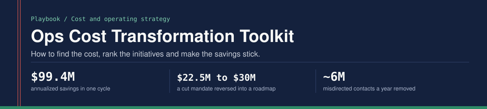
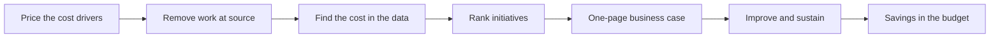

<p align="center"></p>

The method behind a single-cycle cost transformation in a large marketplace operations organization: how to find the cost, rank the initiatives, and make the savings stick.

Built from running cost transformation programs across Amazon's seller-protection operations.

## Results

| Program | Result |
|---|---|
| Largest single-cycle cost transformation in the business unit's history | $99.4M in annualized savings across 10+ concurrent programs, without reducing service coverage |
| Demand removed at source | Approximately 6M misdirected contacts a year eliminated; $10M in annualized savings |
| Repeat contacts | Down 10% (10M to 9M a year) across 15 markets; $5M in annualized savings |
| A cost mandate reframed | A $22.5M opex-cut mandate calling for a 235-headcount reduction, reversed into a $30M savings roadmap with zero net headcount cut and 58 seller-facing growth programs protected |
| Universal-investigator pilot | Specialized queues consolidated into cross-trained pods: rework down from 28% to 3%, average handle time down 25%, approximately $1.1M in annualized savings |
| Workforce plan | Variable cost per unit improved 285 bps; overtime $2.4M to $1.8M; new-hire ramp halved from 4 to 2 weeks |
| Planning discipline | Plan-versus-actual forecast variance down 29 points (36% to 7%); a 66-person resourcing ask reduced to 12; planning cycle cut from 28 to 14 days |

## The problem this solves

Cost programs in operations usually fail for one of three reasons: too many initiatives chasing too little capacity, no rigorous way to rank them, or savings that never reach the budget.

## The method in one picture



## 1. Refuse the headline lever, price the driver

The obvious lever is headcount. It is also the one that takes the capability base with it. When a $22.5M cut was mandated, I built the financial case independently over a three-month cross-functional review and priced the cost drivers one program at a time. The roadmap that came out was worth more than the cut it replaced.

I learned the move as a bank branch manager. The obvious response to bad loans was to stop lending. Pricing the recovery drivers instead (ageing, sector concentration, follow-up cadence) cut non-performing assets 71.4% while deposits and credit both grew.

## 2. Remove the work before speeding it up

Eliminating work is cheaper than doing it faster. Trace repeat and misdirected contacts back to the upstream defect or policy gap that generates them, and remove the demand at source rather than adding capacity to absorb it.

## 3. Find the cost in the data

I write the SQL for this analysis myself. The first query ranks queues by total handle-time cost, which is where any time-reduction initiative starts.

```sql
-- Example: identify the top 10 queues by total handle-time cost
SELECT
  queue_name,
  COUNT(*) AS case_volume,
  AVG(handle_time_seconds) AS avg_handle_time,
  AVG(handle_time_seconds) * COUNT(*) AS total_time_cost
FROM case_data
WHERE case_date >= DATEADD(day, -90, GETDATE())
GROUP BY queue_name
ORDER BY total_time_cost DESC
LIMIT 10;
```

Table and column names are generic placeholders.

## 4. Rank initiatives on three axes

- **Impact:** annualized savings potential
- **Feasibility:** time to implement, dependencies, technical complexity
- **Risk:** quality impact, reversibility, stakeholder sensitivity

Score every initiative the same way and publish the ranking. When a senior leader pushes a favorite, the scores carry the argument.

## 5. One-page business case before any work starts

1. **Problem:** the current state with data, what it costs a year, the root cause
2. **Proposed solution:** what changes, who is affected, the timeline
3. **Financial case:** annualized savings, one-time cost, payback
4. **Risk:** what could go wrong, the quality impact, whether it can be rolled back
5. **Ask:** resources, the decision required, go or no-go criteria

## 6. A continuous-improvement cycle that sticks

1. Go to where the work happens and observe
2. Map the current process end to end
3. Tag each step as value-adding, required, or waste
4. Design the future state without the waste
5. Build the new process into training, quality checks and dashboards

Most queue-removal projects fail because they remove the queue and leave the work. Redesign the underlying process, not only the routing.

## 7. Governance that keeps the numbers honest

A year-round health cadence, with red, amber and green portfolio reviews and quarterly business reviews feeding the annual operating plan, is what turns a resourcing conversation into an evidence conversation.

## Lessons

1. Volume reduction beats productivity improvement.
2. A few initiatives carry most of the savings. Finish them before starting the rest.
3. Savings are not real until they are in the budget. Track realization, not potential.
4. Root cause before solution design, always.
5. Cost and quality are not opposites. If a cost initiative degrades quality, the problem was misdiagnosed.

## What I did and did not do

I led the programs, built the financial cases and ran the governance. I have run Kaizen and lean programs and hold no belt. I write the SQL for my own analysis. Beyond that I work at the strategy and requirements layer, and I do not write or review application code.

## Author

Prateek Ratnakar. AI transformation and program leader; 12 years, nine of them at Amazon (May 2017 - Jun 2026), as Senior Program Manager in Amazon Seller Protection.

Amazon North Star Award (2025 and 2021) | Business Leader of the Year (2019) | IIT (BHU) Varanasi | IIM Bangalore

[Portfolio](https://prateek-ratnakar.github.io) | [LinkedIn](https://www.linkedin.com/in/prateekratnakar) | [GitHub](https://github.com/prateek-ratnakar)

Every figure here matches my resume, my portfolio and my interview answers. The content is generalized; no proprietary systems, data or code are included.
